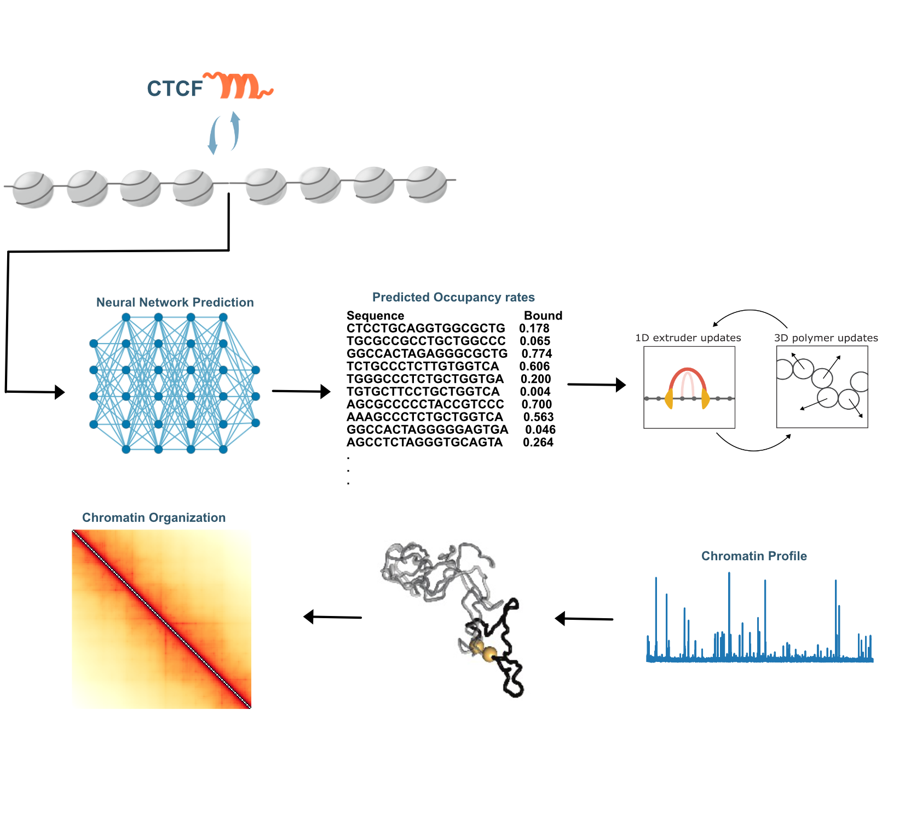

# OccupancyInputCTCF


### Description
This GitHub repository provides tools for training machine learning models to predict 3D chromatin architecture from single-molecule footprinting data (e.g., methylation patterns). It integrates sequence features and occupancy profiles to infer genome folding and validates predictions by comparing Hi-C data with simulated chromatin loop extrusion, incorporating locus-specific occupancy rates and dynamic CTCF barriers.



### Structure of the repository
The structure of this repository follows as below:
- output : files after processing and analyzing the input data.
- analysis: notebooks and code for analyzing simulations and experimental data.
- utils: necessary functions and tools for performing workflow
- models: machine learning models for predicting CTCF occupancy rate.
  
### Requirements
- *Polychrom*: A toolkit for polymer simulations. (https://github.com/open2c/polychrom)
- *OpenMM*: A library for molecular simulations. (https://github.com/openmm/openmm)
- *Open2C* analysis packages (see https://github.com/open2c)

  
## Installation
First, 

```
git clone https://github.com/Fudenberg-Research-Group/OccupancyInputCTCF.git
```

### Workflow
#### Running simulations 
1. One-Dimensional Lattice Simulation: with running `workflow.py`


#### Processing simulation data
After running the simulations, the simulated trajectories can be processed to generate *in silico* ChIP-seq profiles, 1d contact maps, and 3d contact maps (optional). Scripts for data processing available in `processing`. Instructions are provided with the relevant python code.

#### Analysis
Once the data is processed, observable features can be quantified


