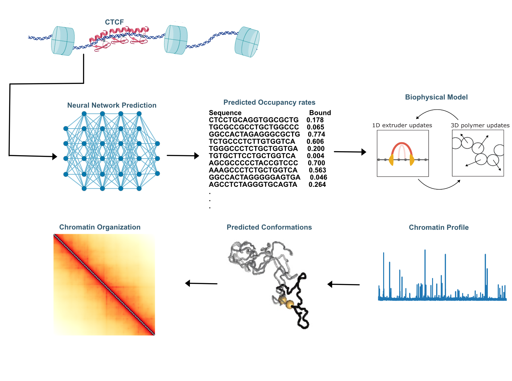

# 🧬 OccuFold


### Description
This repository contains a reproducible Nextflow (DSL2) pipeline that uses a neural-network model to predict CTCF occupancy from SMF/motif data and then prepares the inputs for loop-extrusion simulations to validate those predictions. It keeps key region fields, writes an occupancy track, and produces barrier lists plus a paramdict for simulations. The whole pipeline runs in a Singularity/Apptainer container for consistent, portable results.



#### Structure of the repository
The structure of this repository follows as below:
- processing/: Scripts and pipelines for NGS data processing (e.g., handling SMF methylation footprint data and ChIP-seq data).
#### 🧬 CTCF Binding Site Processing Pipeline

This notebook processes CTCF binding data from single-molecule footprinting (SMF) and ChIP-seq into one-hot encoded DNA sequences for use in machine learning models.

#### 🔄 Pipeline Overview

1. **Load Data**  
   Load CTCF binding site coordinates and binding frequency table.

2. **Filter Sites**  
   Keep only sites with all three biological states:  
   _Accessible, Bound, Nucleosome-occupied_.

3. **Pivot Frequencies**  
   Reshape the table to have one row per site with frequency values for each state.

4. **Merge with Coordinates**  
   Combine genomic coordinates and binding frequency data into a single DataFrame.

5. **Extract Sequences**  
   Use `pyfaidx` to extract sequences from the mm10 reference genome.

6. **One-Hot Encode**  
   Convert sequences into 4×N matrices (A/C/G/T channels) for CNN input.

7. **Visualize**  
   Plot one-hot encoded sequences as grayscale "pixel" images for inspection.

8. **Save Outputs**  
   Write final annotated data to `sites_with_freqs_and_seqs.tsv`.

---
### Requirements

- Nextflow ≥ 24.10

- Java 11+ (for Nextflow)

- Singularity/Apptainer (tested with Singularity 3.8.x)

- Internet access during container build (to install Python packages)

- Access to required data files:

- Reference genome FASTA (e.g., mm10.fa) and index in a readable location

- CTCF peaks BED/CSV/TSV (first 3 columns = chrom,start,end)

- Model weights file (see workflow/files/model_weights)

- CTCF PFM file (e.g., workflow/files/MA0139.1.pfm or .smooth.pfm)

- The Nextflow singularity profile binds this repo and /project into the container, so relative paths like workflow/files/... work if you run from the repo root.

#### 📁 Output

- `sites_with_freqs_and_seqs.tsv` – Final annotated file including:
  - `chrom`, `start`, `end`, `TFBS_cluster`
  - Frequency columns: `Bound`, `Accessible`, `Nucleosome.occupied`
  - DNA `sequence`


- models/: Code for deep learning models (CNN architectures, training scripts, evaluation functions) used to predict CTCF occupancy or 3D contacts
- analysis/: Notebooks or scripts for analyzing results (e.g. comparing predicted vs. actual Hi-C, generating figures).
- utils/: Utility functions and tools (shared helper code for data I/O, metric calculations, etc.).
- outputs/: Folder to store output files, such as processed data or model predictions (keeping them separate from code)

  

<!--### Requirements
- *Polychrom*: A toolkit for polymer simulations. (https://github.com/open2c/polychrom)
- *OpenMM*: A library for molecular simulations. (https://github.com/openmm/openmm)
- *Open2C* analysis packages (see https://github.com/open2c)-->

  
#### Installation
First, 

```
git clone https://github.com/Fudenberg-Research-Group/OccupancyInputCTCF.git
```

### Workflow
#### Running simulations 
1. One-Dimensional Lattice Simulation: with running `workflow.py`


#### Processing simulation data
After running the simulations, the simulated trajectories can be processed to generate *in silico* ChIP-seq profiles, 1d contact maps, and 3d contact maps (optional). Scripts for data processing available in `processing`. Instructions are provided with the relevant python code.

#### Analysis
Once the data is processed, observable features can be quantified


